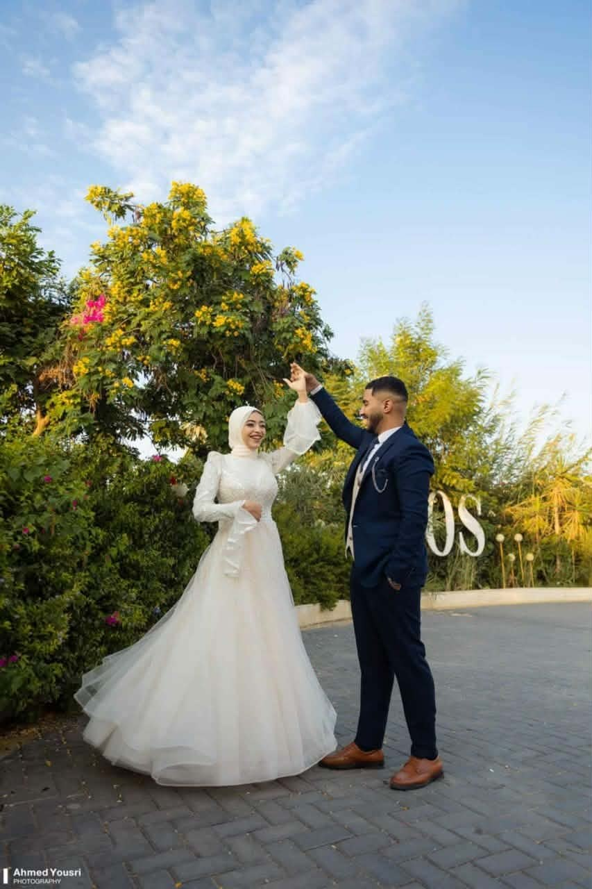

<!doctype html>
<html lang="en">

<head>
  <meta charset="UTF-8" />
  <meta name="viewport" content="width=device-width, initial-scale=1.0" />
  <title>Wedding_Invation</title>
  <meta name="description" content="welcome for you in wedding party" />
</head>
<link rel="stylesheet" href="CSS/widding.css" />
<link rel="stylesheet" href="CSS/display.css" />
<link rel="stylesheet" href="CSS/normalize.css" />
<link rel="preconnect" href="https://fonts.googleapis.com/css2
    ?family=Outfit&family=Young+Serif&display=swap" />
<link rel="preconnect" href="https://fonts.googleapis.com" />
<link rel="preconnect" href="https://fonts.gstatic.com" crossorigin />

<link
  href="https://fonts.googleapis.com/css2?family=Cormorant+Garamond:wght@300;400;500;600;700&family=Great+Vibes&display=swap"
  rel="stylesheet" />
<link rel="stylesheet" href="https://cdnjs.cloudflare.com/ajax/libs/font-awesome/6.5.2/css/all.min.css" />

<body>
  

    

      

        <h1>SAVE <strong>DATE</strong></h1>
        

          AUG
          4
        

      

    

    

      
Our story is just beginning...

      <i class="fa-solid fa-heart"></i>
    

    

      
<strong>H</strong>ANNA <strong>N</strong>IGHT

      

        
        <i class="fa-solid fa-heart"></i>
        
      

    

    

      

        

          <i class="fa-regular fa-calendar-days"></i>
          <b>2</b><i>/</i>8<i>/</i>2026
           
          <i class="fa-regular fa-clock"></i>
          Evening
           
          

            <i class="fa-solid fa-location-dot location-icon"></i>
            Family_House
          

        

        

          

            we are delighted to <b>invite</b> you to celebrate the Henna night
          

        

      

      
    

     
    

    

      
<strong>W</strong>EDDING <strong>D</strong>AY

      

        
        <i class="fa-solid fa-heart"></i>
        
      

    

    

      

        
we are honored by your presence at our wedding day

      

      

        <i class="fa-regular fa-calendar-days"></i>
        <b>4</b><i>/</i>8<i>/</i>2026
         
        <i class="fa-regular fa-clock"></i>
        Evening
         
        

          <i class="fa-solid fa-location-dot location-icon2"></i>
          Hotel
        

      

      

        <h2 id="title">Wedding Count</h2>

        

          

            00
            
Days

          

          

            00
            
Hours

          

          

            00
            
Minutes

          

          

            00
            
Seconds

          

        

        

          

            
            
Day

          

          

            
            
Month

          

          

            
            
Year

          

        

        <h3 id="special-message"></h3>
      

    

    

      
OUR MOMENTS

      

        
        <i class="fa-solid fa-heart"></i>
        
      

      

        
        
        
      

      <i class="fa-regular fa-heart heart-icon"></i>
    

    

      
LEAVE A MESSAGE

      

        
        <i class="fa-solid fa-heart"></i>
        
      

      <form class="message-form">

        

          <i class="fa-regular fa-user"></i>

          <input type="text" placeholder="Your Name" id="username"  />
        

        

          <i class="fa-regular fa-comment"></i>

          <input id="user-message" placeholder="Write your wishes here..." maxlength="500"  />
        

        <button class="submit-btn">
          Send Comment
          
            <i></i><i></i><i></i>
          
        </button>
      </form>
    

    

      DEV by ABDELSALAM
      <i class="fa-brands fa-whatsapp" id="whatsapp-icon"></i>
    

  

  
</body>

</html>
